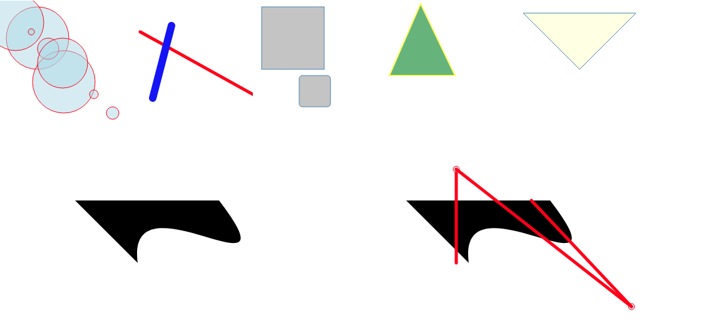

# SVG Basics
Learning the basics of creating SVG elements on the DOM.

## SVG Elements Explored
- Circles
- Rectangles
- Lines
- Polygons
- Paths & Curves
- Transform & Translate
- Scale
- Grouping
- Text

## Technologies Used
- HTML
- CSS
